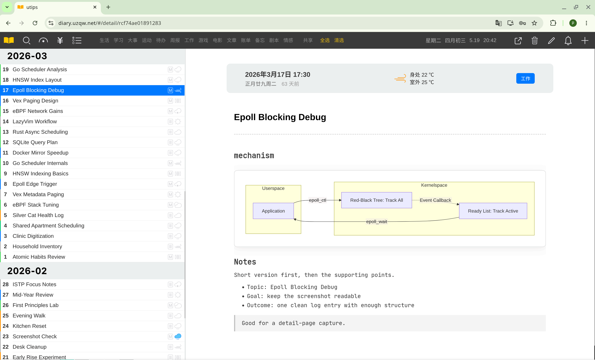

# utips

这是一个日记应用仓库，后端使用 PocketBase，前端基于 Vue。

本仓库按组件拆分目录，因为后端和前端使用不同开源协议。

<div align="center">
  
  <p><i>截图1: utips主界面</i></p>
</div>

## 部署

**重点：先把 `.env` 填好，然后直接运行 `make docker-deploy`。**

```bash
cp .env.example-zh-cn .env
# 编辑 .env，填好必需配置。
make docker-deploy
```

`.env` 填好以后，部署只需要执行 `make docker-deploy`。默认服务地址是 `http://<server-ip>:17172`。

## 功能概览

- 基于 PocketBase 的认证和数据存储。
- 支持日记、分类、通知、待办和日历同步相关能力。
- Vue 3 前端，基于上游 diary 项目改造。
- 本地化部署，PocketBase 使用 SQLite，运行数据默认放在 `unotes_data/`。

## 开发

环境要求：

- 后端：Go 1.25 或更高版本。
- 前端：与当前前端工具链兼容的 Node.js 和 npm。

在仓库根目录运行：

```bash
make backend-dev
make frontend-dev
```

在仓库根目录构建：

```bash
make backend-build
make frontend-build
```

PocketBase 运行数据默认位于仓库根目录 `unotes_data/`，该目录不会提交到 Git。构建产物 `frontend/dist/` 也不会提交到 Git。

## 项目治理

- 安全策略：`SECURITY.md`。
- 贡献说明：`CONTRIBUTING.md`。
- 环境变量示例：`.env.example`。
- 前端上游说明：`frontend/NOTICE.md`。

## 开源前清理说明

本仓库已按开源发布习惯排除以下内容：

- PocketBase 运行数据：`unotes_data/`。
- SQL 导出、本地归档文件。
- Google Calendar 凭证和 service account JSON 文件。
- 构建产物和依赖目录，例如 `dist/`、`node_modules/`。

发布前建议轮换任何曾经进入旧私有历史的凭证。清空 Git 历史只能避免旧提交继续公开，但不能让已经暴露过的凭证失效。

## English README

英文版见 `README.md`。

## 开源协议

这是一个多协议仓库：

| 路径 | 协议 | 说明 |
| --- | --- | --- |
| `backend/` | MIT | PocketBase 后端实现，详见 `backend/LICENSE`。 |
| `frontend/` | GPL-3.0 | 基于 `https://github.com/KyleBing/diary`，详见 `frontend/LICENSE`。 |

不要把整个仓库视为单一协议项目。分发、修改或复用某个组件时，需要遵守该组件所在目录对应的协议。
